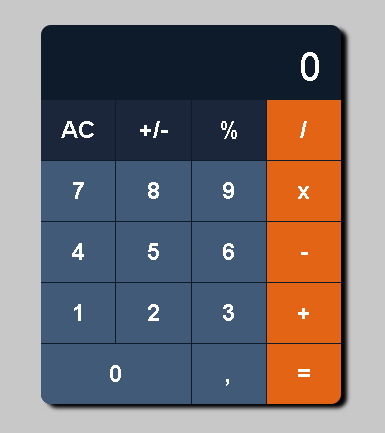

# Calculadora

Projeto de uma calculadora funcional, desenvolvida para praticar e reforçar conceitos fundamentais de Front-end, como manipulação de DOM, lógica de funções e layouts com CSS Grid.

---

## Funcionalidades

* **Operações Básicas**: Adição, subtração, multiplicação e divisão.
* **Porcentagem**: Cálculo de porcentagem dinâmico.
* **Inversão de Sinal**: Alterna entre números positivos e negativos através do botão `+/-`.
* **Interface Responsiva**: Layout adaptável utilizando CSS Grid e Flexbox.

---

## Tecnologias Utilizadas

* **HTML5**: Estruturação dos elementos e botões.
* **CSS3**: Estilização personalizada, uso de variáveis e Grid Layout.
* **JavaScript (ES6+)**: Lógica de programação, eventos de clique e processamento de cálculos.

---

## Resultado Visual

